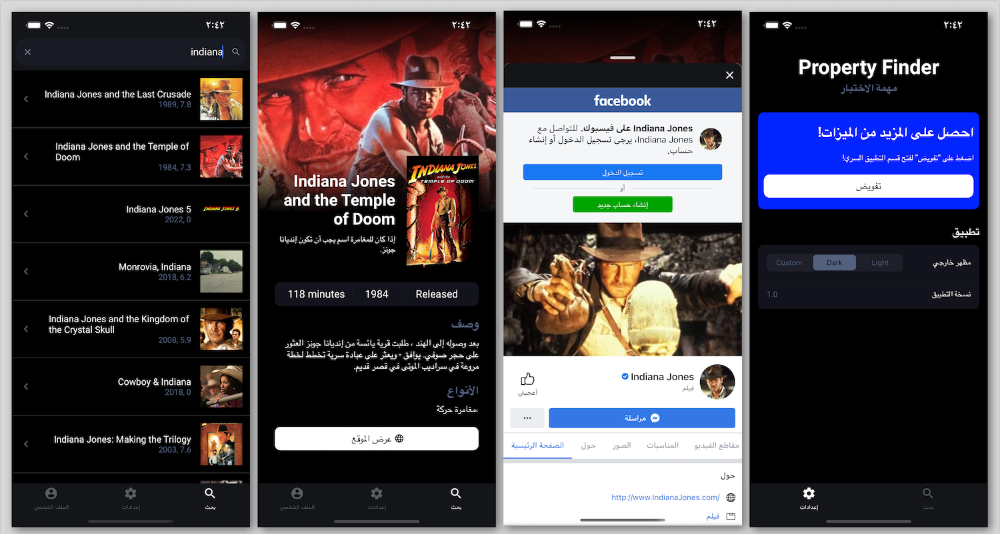
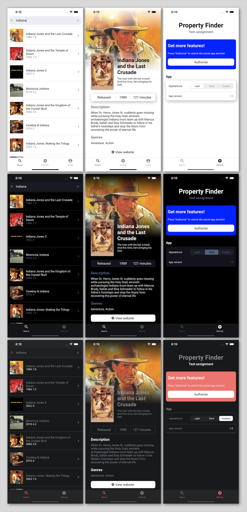

# PropertyFinder test

Basic movies search app

## Features

### Localization and RTL ready



### Multiple theme support



## Setup

```
npm i
npx pod-install
```

## E2E

-   Make sure you have [Detox setup](https://github.com/wix/Detox/blob/master/docs/README.md)
-   Make sure you have `iPhone 11 Pro Max` simulator installed
-   Prepare build for test

```
// Debug
npm run e2e:build:ios

// Release
npm run e2e:build-release:ios
```

-   Run tests

```
// Debug
npm run e2e:test:ios

// Release
npm run e2e:test-release:ios
```

## Supported deeplinks formats

```
pftest://movies/:id
pftest://settings
pftest://profile
```

Try in out!

```
npx uri-scheme open pftest://movies/6479 --ios
```

## Others commands

-   `npm run check:ts` - typescript validation
-   `npm run lint` - linting

## Libraries highlights

-   `@react-navigation` - used as main navigation library, nice choose between flexibility and performance.
-   `styled-components` - the main tool for styles.
-   `redux` - used for state management in combination with `@reduxjs/toolkit` that help in boilerplate reducing.
-   `axios`, `lodash` - pack of small utils.
-   `i18n-js` and `react-native-localize` - used for internationalization.
-   `react-native-config` - used to expose environment variables to follow [12-FactorApp](https://12factor.net/config).
-   `react-native-fast-image` - replaced build-in image library since it offers performance improvements and cache feature.
-   `prettier`, `husky`, `lint-staged` - pre-commit linting, validation and formatting.
